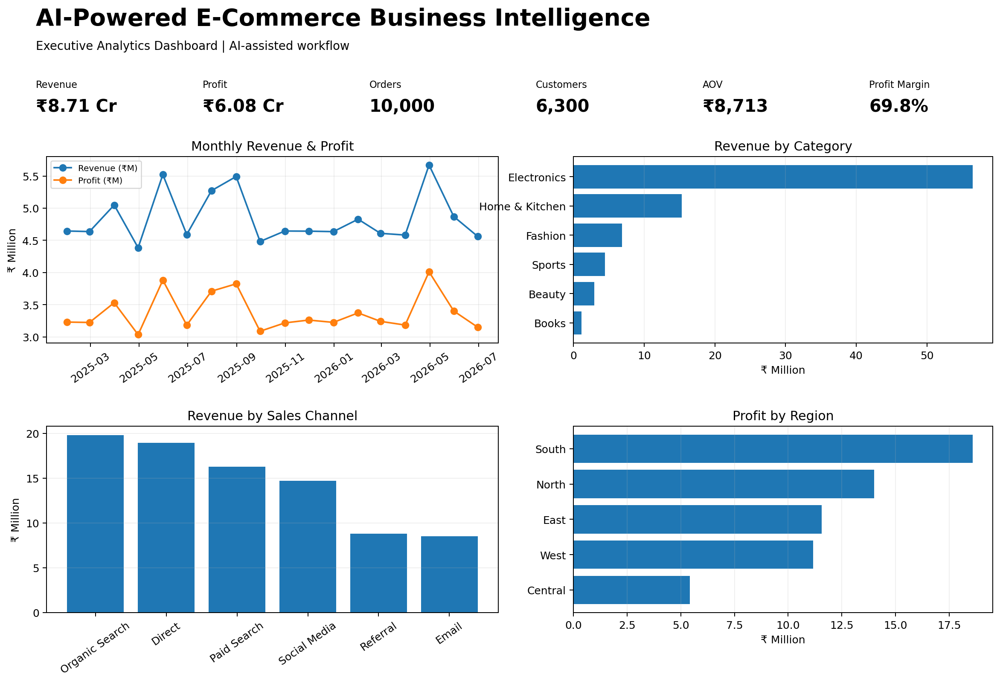

# AI-Powered E-Commerce Business Intelligence

## Executive Summary
An AI-assisted e-commerce analytics project designed to demonstrate how a modern analyst can move from raw transaction data to business decisions using AI, SQL, Python and BI thinking.

### Business Objective
Analyze sales, customer segments, product categories, regions and sales channels to identify revenue opportunities, profitability drivers and actionable business recommendations.

## Tech Stack
- SQL
- Python (Pandas)
- - BI Dashboard / Data Visualization
- Generative AI for analysis assistance
- GitHub

## Dataset
10,000 synthetic e-commerce orders covering January 2025 to June 2026.

## Key KPIs
- Orders: 10,000
- Unique customers: 6,300
- Revenue: ₹87,132,347.19
- Profit: ₹60,776,232.75
- Average order value: ₹8,713.23
- Profit margin: 69.75%

## Key Findings
- Revenue leader: Electronics generated the highest category revenue.
- Profitability leader: Electronics has the highest category profit margin.
- Channel leader: Organic Search generated the highest revenue among sales channels.
- Regional leader: South generated the highest revenue among regions.
- Overall order value is approximately ₹8,713, with an overall profit margin of 69.8%.

## AI-Assisted Workflow
1. AI-assisted data profiling and quality review
2. AI-assisted SQL query generation
3. Python-based validation and analysis
4. AI-assisted insight generation
5. KPI and dashboard design
6. Human validation of calculations and recommendations

> AI was used as an analytical copilot. Final metrics and conclusions were programmatically validated before inclusion.

## Portfolio Value
This project demonstrates transferable skills for Data Analyst, Business Analyst, BI Analyst, Marketing/Growth Analyst and Product Analyst roles.

## Repository Structure
```text
AI_Ecommerce_Business_Intelligence/
├── README.md
├── data/
├── sql/
├── python/
├── dashboard/
├── business-insights/
└── screenshots/
```
## Dashboard Preview



## How Generative AI Was Used

Generative AI was used as an analytical copilot throughout the project.

- Assisted with data profiling and quality checks
- Generated and refined SQL analysis queries
- Assisted with Python/Pandas exploratory analysis
- Helped identify trends, anomalies and business opportunities
- Assisted in KPI and dashboard design
- Converted analytical findings into business recommendations
- Final calculations and insights were validated before reporting

AI was used to accelerate analytical work while human validation was applied to ensure accuracy and business relevance.

## Business Value

This project demonstrates an AI-first analytics workflow that transforms raw e-commerce transaction data into actionable business intelligence.

The workflow is designed for Data Analyst, Business Analyst, BI Analyst, Marketing/Growth Analyst and Product Analyst use cases.

## Future Enhancements

- Build an interactive Power BI dashboard
- Add customer retention and churn prediction
- Add RFM customer segmentation
- Add automated AI insight generation
- Add real-time analytics pipeline
